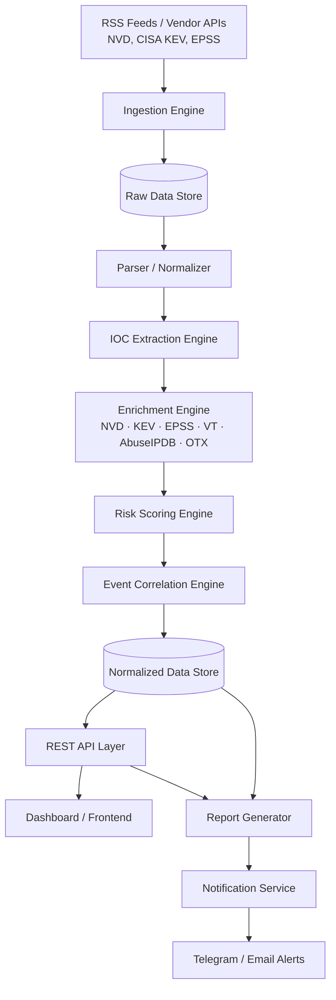
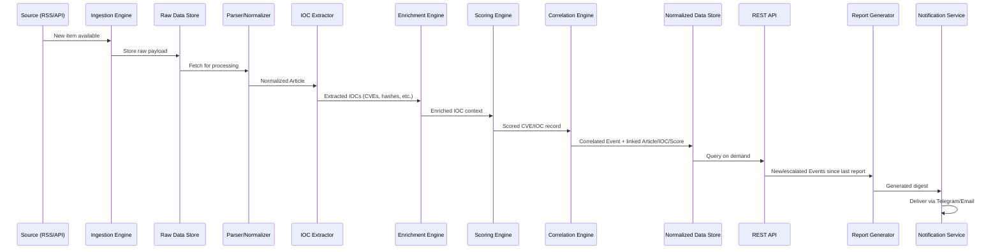

# ThreatLens — Software Design Document (SDD)

**Document type:** Software Design Document
**Status:** Draft v1.0 — Pre-Implementation
**Audience:** Engineering (self), portfolio reviewers, hiring panels

---

## 1. Project Title — ThreatLens

**Name:** ThreatLens

**Rationale:** The platform's core function is to take a diffuse, noisy stream of raw cybersecurity information and bring it into focus as structured, prioritized intelligence — the way a lens takes scattered light and resolves it into a sharp image. "Threat" anchors the domain immediately for any technical reviewer (recruiter, hiring manager, fellow analyst) scanning a GitHub profile. "Lens" implies the value-add this project is built around: not collection, but clarity. The name also avoids overstating scope — it does not claim to be a full SIEM, a detection engine, or an enterprise MISP replacement, which keeps expectations calibrated to what the project actually is: a focusing mechanism for threat intelligence.

Other names considered and rejected for this document: *IntelForge* (implies heavier data-fabrication/creation than the project does), *SentinelTI* (overlaps too closely with existing commercial product naming conventions), *ThreatPulse* (implies real-time/live monitoring more aggressively than the MVP delivers). ThreatLens was chosen as the most honest description of the system's actual function.

---

## 2. Executive Summary

ThreatLens is a self-hosted Threat Intelligence aggregation and enrichment platform that collects raw cybersecurity reporting from public sources (security news outlets, vendor advisories, CVE feeds, and government alerts), and transforms that raw text into structured, scored, and correlated threat intelligence.

The platform exists because the volume of public cybersecurity reporting has outpaced any individual analyst's ability to read it all, and because raw reporting — a headline, an article, a tweet — is not itself actionable. A headline that says "critical vulnerability found in widely used software" tells an analyst nothing about whether they should act today or next quarter. ThreatLens's job is to close that gap: to take the same raw material a human analyst would read, and instead extract the indicators, attach authoritative context (severity, exploitation status, exploitability prediction), correlate duplicate reporting into single events, and produce a ranked, explainable risk signal.

This solves three concrete problems that real security teams experience daily:

1. **Volume** — dozens of new CVEs and articles per day, far more than can be manually triaged.
2. **Duplication** — the same vulnerability or campaign reported by five outlets, consuming analyst attention five times over.
3. **Lack of prioritization** — without context like CISA KEV status or EPSS score, every CVE looks equally urgent, which in practice means none of them get appropriate urgency.

The intended users are SOC analysts, threat intelligence analysts, and vulnerability management teams — people whose job is to answer "what do I need to act on today, and why." Organizations need systems like this because the cost of missing a genuinely critical, actively-exploited vulnerability is high, while the cost of analyst burnout from chasing irrelevant alerts is also high. ThreatLens is designed to sit between raw public reporting and the analyst's decision, doing the triage work that does not require human judgment, so that human judgment is reserved for the cases that actually need it.

---

## 3. Project Vision

The long-term vision for ThreatLens is to function as a lightweight, transparent, and extensible decision-support layer for threat intelligence work — not to replace analyst judgment, but to remove the mechanical burden that currently consumes most of an analyst's day before judgment is even possible.

Specifically, the platform aims to:

- **Reduce alert fatigue** by ensuring that what reaches the analyst is already deduplicated, scored, and contextualized — not a raw firehose of headlines.
- **Automatically prioritize** threats using a transparent, explainable scoring model rather than a black-box classification, so that an analyst can see *why* something is ranked the way it is and override it when their own context says otherwise.
- **Aggregate and normalize** intelligence from structurally different sources (RSS feeds, JSON APIs, HTML pages) into one consistent internal data model, so that downstream logic never needs to know where a given piece of information originated.
- **Build actionable intelligence, not just collect raw news.** The distinguishing output of this system is never "here is an article." It is always "here is an indicator, here is its context, here is why it matters, here is what to do next."
- **Provide meaningful context** at the point of decision — CVSS score, KEV status, EPSS probability, affected vendors, related historical events — collapsed into one view rather than scattered across five different lookup tools the analyst would otherwise have to query manually.

Over time, the vision extends toward correlation across longer time horizons (campaign tracking, threat actor activity trends) and toward making the platform's outputs interoperable with the broader threat intel ecosystem (MISP, STIX/TAXII) rather than a closed, single-purpose tool.

---

## 4. Purpose of the Project

### News Aggregator vs. Threat Intelligence Platform

A **news aggregator** collects content and presents it. Its unit of value is the article: it answers "what was published?" Success is measured by coverage and freshness.

A **Threat Intelligence Platform** transforms content into decision-relevant signal. Its unit of value is the *assessed indicator* or *event*: it answers "what changed in the threat landscape, how severe is it, and is it relevant to me?" Success is measured by precision, context, and the speed at which a consumer of the output can make a correct decision.

**ThreatLens is explicitly the second kind of system.** It is built on the premise that scraping a website and forwarding the headline to Telegram is the *easy* 20% of this problem and produces close to 0% of the value a real TI consumer needs. The hard, valuable 80% is everything that happens after collection:

- **IOC Extraction** — pulling structured indicators (CVE IDs, IPs, domains, hashes, malware/actor names) out of unstructured prose, so that the data becomes queryable and machine-actionable rather than trapped in sentence form.
- **Enrichment** — attaching authoritative external context to each indicator (Is this CVE in CISA's Known Exploited Vulnerabilities catalog? What is its CVSS score? What is its EPSS exploitation probability?) so the indicator carries real meaning instead of just an identifier.
- **Correlation** — recognizing that five articles from five outlets are reporting on the *same* underlying event, and collapsing them into one entity with multiple corroborating sources, rather than presenting five redundant alerts.
- **Risk Scoring** — combining enrichment signals into a single, explainable priority score, so consumers can sort by "what matters most" instead of "what was published most recently."
- **Historical Analysis** — tracking how the threat landscape changes over time (which vendors are trending in vulnerability disclosures, which malware families recur, which CVEs are getting renewed attention weeks after initial disclosure), which is information no single article can provide because it requires memory across time.

A news aggregator has no opinion about what matters. ThreatLens's entire purpose is to have a defensible, transparent opinion about what matters, backed by evidence the analyst can inspect and override.

---

## 5. Target Users

| User Type | Primary Need | How ThreatLens Helps |
|---|---|---|
| **SOC Analyst** | Quickly understand what's urgent right now without reading dozens of articles | Ranked, deduplicated event feed with explainable risk scores; daily digest summarizing only what changed or escalated |
| **Threat Intelligence Analyst** | Track campaigns, actors, and malware families over time; build context for reports | Historical trend views, actor/malware tagging, correlated event timelines, exportable structured data |
| **Security Researcher** | Stay current on emerging vulnerabilities and techniques without manual source-monitoring | Automated multi-source ingestion with IOC extraction, searchable by CVE/actor/technique |
| **Blue Team / Defensive Engineering** | Know which CVEs affect their stack and whether active exploitation is occurring | KEV-flagged, vendor/product-tagged CVE records; can filter by technology relevant to their environment |
| **Incident Response Team** | During an active incident, quickly check if an observed IOC (hash, domain, IP) has public reporting associated with it | Searchable IOC database cross-referenced against ingested reporting and enrichment sources |
| **Vulnerability Management Team** | Decide patch prioritization order across a large CVE backlog | Risk-scored CVE records combining CVSS + KEV + EPSS, sortable and filterable, instead of CVSS alone |

Each of these roles shares one underlying need that the project is built around: **moving from "what was published" to "what should I do about it,"** just applied to different decision contexts (triage, campaign tracking, patch prioritization, incident lookup).

---

## 6. Project Goals

1. **Automated, multi-source collection** — continuously ingest cybersecurity reporting from RSS feeds, JSON/REST APIs (NVD, CISA KEV), and HTML sources without manual intervention.
2. **Data normalization** — represent structurally different source formats in one consistent internal schema so downstream processing is source-agnostic.
3. **Structured indicator extraction** — convert unstructured article text into structured IOC records (CVE IDs, hashes, IPs, domains, actor/malware names).
4. **Authoritative enrichment** — attach external context (CVSS, KEV status, EPSS score, reputation data) to every extracted indicator.
5. **Defensible vulnerability prioritization** — produce a transparent, explainable risk score per CVE/event rather than relying on a single raw metric.
6. **False positive reduction** — apply structured extraction and enrichment specifically to reduce the false-positive rate inherent in pure keyword matching.
7. **Event-level deduplication and campaign tracking** — collapse duplicate reporting into single events and track related events over time as potential campaigns.
8. **Recurring reporting** — generate a daily summary digest highlighting new, escalated, and trending threats.
9. **Production of intelligence, not raw alerts** — every output artifact (digest, dashboard view, Telegram message) must include context and justification, never a bare headline.

---

## 7. Real-World Problem Statement

Security teams — particularly SOC and TI teams at small-to-mid-sized organizations without a dedicated, expensive commercial TI feed — face a consistent set of operational problems:

**Problem: Alert and information volume exceeds analyst capacity.**
Dozens of new CVEs are published daily; security news outlets publish dozens more articles. No analyst can read all of it and still do their other job functions.
→ *ThreatLens addresses this by automating the reading and pre-filtering layer, surfacing only items that clear an enrichment-informed relevance/severity bar.*

**Problem: The same event is reported redundantly across sources.**
A significant ransomware campaign or zero-day will be covered by The Hacker News, BleepingComputer, CISA, and a dozen blogs within 48 hours, all describing the same underlying event with different headlines.
→ *ThreatLens addresses this through event correlation — clustering articles that refer to the same underlying CVE/campaign into a single event record with multiple corroborating sources, instead of presenting each as a separate alert.*

**Problem: Raw severity metrics don't reflect real-world risk.**
A CVSS 9.8 vulnerability that is purely theoretical and unexploited is, in practical prioritization terms, often less urgent than a CVSS 6.5 vulnerability that is being actively exploited in the wild. Teams that prioritize on CVSS alone frequently misallocate remediation effort.
→ *ThreatLens addresses this by layering CISA KEV (confirmed active exploitation) and EPSS (predicted exploitation probability) on top of CVSS, and computing a composite score that better reflects real-world urgency.*

**Problem: No persistent memory of the threat landscape.**
Without historical tracking, teams cannot easily answer questions like "is this vendor seeing an unusual spike in disclosed vulnerabilities this month?" or "has this threat actor been mentioned in reporting before, and in what context?"
→ *ThreatLens addresses this by persisting all ingested and enriched data and providing trend views over time — turning isolated articles into a queryable historical record.*

**Problem: Analysts spend disproportionate time on mechanical triage instead of analysis.**
Reading, cross-referencing CVE databases, checking exploitation status, and checking for duplicate reporting are all necessary but largely mechanical tasks that consume time that could otherwise go to actual judgment-requiring analysis.
→ *ThreatLens automates the mechanical layer entirely, so the analyst's time starts at the point where judgment is actually required.*

---

## 8. Core Concepts

### 8.1 Threat Intelligence

Threat intelligence is evidence-based knowledge — about an existing or emerging threat to assets — that can inform decisions about how to respond. Critically, intelligence is distinct from raw data: a list of IP addresses is data; "these IP addresses have been observed as C2 infrastructure for [campaign], active since [date], targeting [sector]" is intelligence. The defining property of intelligence is that it has been processed, contextualized, and made relevant to a decision. ThreatLens's processing pipeline exists entirely to perform that transformation at scale.

### 8.2 Indicators of Compromise (IOCs)

IOCs are discrete, observable artifacts that indicate a potential security event has occurred or is in progress. ThreatLens focuses on extracting the following IOC types from ingested text:

- **CVEs** (e.g., `CVE-2024-12345`) — standardized identifiers for publicly disclosed software vulnerabilities. These are the backbone of the vulnerability management use case.
- **Domains** — hostnames associated with malicious infrastructure (phishing domains, C2 domains).
- **URLs** — full malicious links referenced in reporting (e.g., a phishing kit URL or malware delivery link).
- **IP Addresses** (IPv4/IPv6) — addresses associated with malicious infrastructure such as command-and-control servers or scanning sources.
- **File Hashes** (MD5, SHA1, SHA256) — unique fingerprints of malicious files, used to identify known malware samples across different naming conventions.
- **Threat Actors** — named individuals or groups (e.g., "Lazarus Group," "Scattered Spider") attributed to a campaign or technique.
- **Malware Families** — named malware strains (e.g., "LockBit," "Emotet") that recur across multiple campaigns and reports.

Each IOC type has a different extraction strategy (regex pattern for hashes/IPs/CVEs, gazetteer/NER for actor and malware names) and a different enrichment path, both detailed in later sections.

### 8.3 Intelligence Enrichment

Extraction alone produces identifiers, not context. A bare `CVE-2024-12345` is meaningless without knowing its severity, whether it is being actively exploited, and how likely exploitation is in the near term. Enrichment is the process of querying authoritative external sources to attach that context automatically. ThreatLens's design (implementation deferred to later phases) anticipates enrichment from:

- **NVD (National Vulnerability Database)** — the authoritative source for CVE metadata: CVSS base score and vector, affected vendors/products (CPE data), and the official vulnerability description. This is the baseline severity context for any extracted CVE.
- **CISA KEV (Known Exploited Vulnerabilities catalog)** — a curated list maintained by CISA of vulnerabilities with *confirmed* active exploitation in the wild. Presence on this list is one of the strongest available signals that a vulnerability requires urgent attention, regardless of its raw CVSS score.
- **EPSS (Exploit Prediction Scoring System)** — a model-driven score estimating the probability that a given CVE will be exploited in the next 30 days. This provides a forward-looking signal that complements KEV's backward-looking "already confirmed exploited" signal.
- **VirusTotal** — multi-engine reputation and detection data for file hashes, domains, IPs, and URLs; useful for assessing whether an extracted IOC is independently corroborated as malicious.
- **AbuseIPDB** — community-reported abuse history for IP addresses, useful for triaging IP-type IOCs.
- **AlienVault OTX (Open Threat Exchange)** — community-contributed threat intelligence pulses that can provide additional campaign/actor context for IOCs that appear in shared "pulses."

At this design stage, no enrichment API is implemented — the architecture only specifies *what* each source contributes and *why* it is needed, so that the enrichment engine module (Section 12) can be built against a clear specification later.

### 8.4 Risk Scoring

**Why CVSS alone is insufficient:** CVSS measures theoretical severity — how bad a vulnerability *could* be if exploited — but says nothing about whether exploitation is actually occurring or likely. Two CVEs with identical CVSS 9.8 scores can have wildly different real-world urgency: one might be exploited in active ransomware campaigns today, the other might be a theoretical finding in an obscure, rarely-deployed product with no known exploitation. Prioritizing purely by CVSS treats these as equally urgent, which misallocates scarce remediation time.

**Why KEV and EPSS matter:** KEV answers "is this being exploited *right now*, confirmed" — a near-certain signal of urgency. EPSS answers "how likely is exploitation *soon*" — a probabilistic, forward-looking signal that helps prioritize *before* something reaches KEV. Combining both with CVSS produces a far more realistic urgency signal than any single metric alone.

**How risk scores help analysts:** A composite, transparent score lets an analyst sort a backlog of hundreds of CVEs and trust that the top of the list represents genuine priority — not just "scariest-sounding" or "most recently published." Because the score is explainable (a weighted combination of named factors, not a black box), the analyst can also inspect *why* something scored highly and adjust their response accordingly, or override the score when they have context the model doesn't (e.g., "we don't run this product at all").

### 8.5 Event Correlation

A single real-world vulnerability disclosure or campaign frequently generates many independent pieces of reporting: a vendor advisory, a CISA alert, multiple security news articles, and several blog posts, often published within hours of each other and often referencing the same CVE ID or campaign name.

**Why this matters:** Without correlation, an analyst-facing feed shows the same underlying threat five or more times, consuming attention and creating the *appearance* of higher event volume than actually exists. Correlation collapses these into a single **Event** entity — one record representing "this CVE / this campaign" — with all corroborating articles attached as supporting sources. This serves two purposes: it reduces noise for the consumer, and it strengthens confidence in genuinely significant events, since an event corroborated by five independent sources is more credible than one reported by a single blog.

### 8.6 Historical Analysis

Treating every article as a disconnected, momentary event discards information that only becomes visible across time. Persisting all ingested and enriched data enables retrospective and trend analysis such as:

- **Weekly trends** — is overall reporting volume increasing, and in which categories (ransomware, zero-days, data breaches)?
- **Most exploited vendors** — which vendors/products appear most frequently in KEV-flagged CVEs over a rolling window?
- **Most active threat actors** — which named actors/groups are mentioned with increasing frequency, suggesting heightened current activity?
- **Top malware families** — which malware strains recur across the most distinct campaigns/articles?
- **Trending/resurfacing CVEs** — a CVE disclosed months ago that suddenly reappears in new reporting (often signaling a new exploitation wave or a newly available public exploit).

This matters because point-in-time alerting alone can miss slow-building patterns that only resolve into significance when viewed across days or weeks — exactly the kind of context a TI analyst's quarterly or monthly threat landscape report depends on.

---

## 9. High-Level Architecture

**Component responsibilities:**

- **RSS Feeds / Vendor APIs** — the external world: unauthenticated public sources (RSS/Atom feeds from news outlets) and structured APIs (NVD, CISA KEV JSON feed, EPSS CSV/API). This is intentionally feed/API-first rather than HTML-scraping-first, since feeds are stable and lower-maintenance; HTML scraping is reserved only for sources with no feed/API alternative.
- **Ingestion Engine** — scheduled jobs (cron-style or task-queue-driven) that pull from each configured source on an appropriate interval and hand off raw payloads downstream. Knows nothing about content meaning — its only job is reliable retrieval.
- **Raw Data Store** — persists every ingested item exactly as received, before any filtering or transformation. This is a deliberate architectural choice: filtering before storage is irreversible, while storing raw and filtering downstream means scoring/extraction logic can be improved retroactively and re-run against historical data.
- **Parser / Normalizer** — converts heterogeneous source formats (RSS XML, JSON API responses, HTML) into one consistent internal `Article`/`Record` schema, so every downstream component operates on a single shape regardless of origin.
- **IOC Extraction Engine** — applies regex and NER-style logic to normalized text to produce structured IOC records (Section 8.2).
- **Enrichment Engine** — queries external authoritative sources for each extracted indicator and attaches context (Section 8.3).
- **Risk Scoring Engine** — computes a composite, explainable risk score per CVE/event using enrichment outputs (Section 8.4).
- **Event Correlation Engine** — clusters records referring to the same underlying vulnerability/campaign into unified Event entities (Section 8.5).
- **Normalized Data Store** — the canonical, query-ready database holding articles, IOCs, enrichment results, scores, and correlated events — this is what every consumer-facing component reads from.
- **REST API Layer** — exposes normalized data to internal consumers (dashboard, report generator) through a stable, documented interface, decoupling storage internals from presentation.
- **Dashboard / Frontend** — human-facing interface for browsing, searching, and filtering events/IOCs/CVEs.
- **Report Generator** — produces the recurring daily/weekly digest by querying the API layer for new and escalated items.
- **Notification Service** — routes generated reports/alerts to configured channels.
- **Telegram / Email Alerts** — terminal delivery channels for human consumption outside the dashboard.

---

## 10. Technology Stack

| Technology | Role | Why this technology specifically |
|---|---|---|
| **Python** | Core ingestion, extraction, enrichment, and scoring logic | Dominant language in the security tooling ecosystem; mature libraries for HTTP, parsing, and regex/NLP; lowest friction between "what a SOC/TI job actually uses" and "what this project demonstrates" |
| **FastAPI** | REST API layer | Async-native (matters for an I/O-heavy system making many outbound enrichment calls), automatic OpenAPI documentation generation (valuable for portfolio presentation — a self-documenting API is a strong artifact to show), strong typing via Pydantic integration |
| **PostgreSQL** | Primary normalized data store | Relational structure fits this domain well (articles → IOCs → enrichment → events are naturally relational, foreign-keyed entities); mature, production-credible choice (vs. SQLite, which signals "prototype" rather than "platform"); supports future extensions like `pgvector` for similarity-based deduplication |
| **SQLAlchemy** | ORM / database access layer | Decouples application logic from raw SQL, provides a migration-friendly model layer, and is the de facto standard ORM in the Python ecosystem — relevant experience for almost any backend role |
| **Alembic** | Database schema migrations | Pairs with SQLAlchemy; demonstrates schema-evolution discipline (versioned, reviewable migrations) rather than ad hoc manual schema edits, which is exactly the practice expected in a real engineering environment |
| **Redis** | Caching + task queue broker | Two distinct roles: (1) caching enrichment lookups (NVD/KEV/EPSS results) to avoid redundant external calls for the same CVE, and (2) serving as the message broker for Celery's task queue |
| **Celery** | Asynchronous task execution / scheduling | Enrichment calls to multiple external APIs are I/O-bound and benefit from async/parallel execution; Celery also handles scheduled recurring jobs (ingestion runs, daily report generation) in a way that's observable and retry-capable, unlike a bare cron script |
| **Docker** | Containerization / deployment | Makes the entire multi-service stack (API, database, Redis, workers) reproducible with a single `docker-compose up`, which matters both for genuine portability and for how easy the project is for a reviewer to actually run and evaluate |
| **n8n** | Orchestration glue for notification routing and simple conditional alerting | Used deliberately for the *thin* layer of the system — scheduling triggers, Telegram/email delivery, simple conditional branching — rather than for core logic. This is an intentional division of labor: Python owns ingestion/extraction/enrichment/scoring (the logic that needs real testing and version control), n8n owns delivery orchestration (the part that benefits from visual, low-code maintainability) |
| **Pydantic** | Data validation / schema definitions | Enforces that data crossing module boundaries (API responses, internal records) conforms to an explicit, typed schema — catches malformed data early rather than letting it silently propagate through the pipeline |

---

## 11. Database Overview

This section describes the conceptual purpose of each core table. Schema/SQL definitions are deferred to the implementation phase.

- **Sources** — represents each origin ThreatLens ingests from (e.g., "The Hacker News RSS," "CISA KEV API," "NVD API"). Stores source type, polling interval, and a credibility/confidence weight used later in scoring and correlation confidence.
- **Articles** — the normalized representation of every raw ingested item (a news article, an advisory, a feed entry), regardless of originating source type. This is the row-level unit of ingestion.
- **IOCs** — structured indicators extracted from Articles: CVE IDs, IPs, domains, hashes, actor names, malware family names, each tagged with its type and the Article(s) it was extracted from.
- **CVEs** — a specialized, enriched extension of the IOC concept specifically for vulnerability identifiers, holding CVSS data, affected vendor/product information, and enrichment metadata (KEV status, EPSS score) once those lookups are implemented.
- **Threat Actors** — a reference table of named actor/group entities, allowing many Articles/Events to reference the same actor consistently rather than as free-text strings.
- **Events** — the correlated, de-duplicated entity representing a single real-world vulnerability disclosure or campaign, linking together every corroborating Article and associated IOC/CVE.
- **Risk Scores** — the computed, versioned output of the scoring engine for a given CVE or Event, stored historically (not overwritten) so that score evolution over time is itself trackable data.
- **Reports** — generated digest artifacts (daily/weekly summaries), stored so that past reports remain retrievable and auditable rather than only existing as ephemeral Telegram messages.

The guiding design principle across all tables: **raw ingested data is never overwritten or discarded**, and every derived artifact (IOC, score, event, report) is traceable back to the Article(s) and Source(s) it was derived from.

---

## 12. Project Modules

- **Ingestion Engine** — Responsible for connecting to each configured Source (RSS/Atom feed, JSON API, or HTML fallback) on a schedule, retrieving new items since the last successful run, and writing them to the Raw Data Store unmodified. Owns retry/backoff logic and per-source error isolation (one failing source must not block others).
- **Parser** — Responsible for converting each source-specific raw payload format (RSS XML, JSON, HTML) into the project's internal normalized record shape. One parser implementation per source *type*, not per individual source, to keep this module extensible as new sources are added.
- **Normalizer** — Responsible for cleaning and standardizing parsed content: stripping HTML artifacts from text, standardizing date/timestamp formats, deduplicating exact-match items already seen from the same source.
- **IOC Extractor** — Responsible for scanning normalized Article text and producing structured IOC records using regex (CVEs, IPs, hashes, domains/URLs) and gazetteer/NER-style matching (threat actor names, malware family names).
- **Enrichment Engine** — Responsible for taking extracted IOCs (primarily CVEs, secondarily IPs/domains/hashes) and querying the relevant external authoritative source for each, attaching the returned context to the corresponding database record. Owns caching (via Redis) to avoid redundant lookups for previously-enriched indicators.
- **Scoring Engine** — Responsible for computing the composite risk score for each CVE/Event from its enrichment data, using the transparent weighted model described in Section 8.4, and persisting the result (with its component breakdown) to the Risk Scores table.
- **Correlation Engine** — Responsible for detecting when multiple Articles refer to the same underlying CVE/campaign (via shared CVE IDs, high text similarity, or shared named entities) and merging them into a single Event record with multiple corroborating sources.
- **Report Generator** — Responsible for querying the normalized store on a schedule (daily) and producing a structured digest: new events since last report, any score escalations, and notable trend changes.
- **Notification Service** — Responsible for taking a generated Report or a high-priority Event and routing it to configured delivery channels (Telegram, email), applying any channel-specific formatting.
- **REST API** — Responsible for exposing all normalized data (Articles, IOCs, CVEs, Events, Reports) through documented, stable endpoints for internal consumption by the Dashboard and external consumption by any future integration.
- **Dashboard** — Responsible for the human-facing presentation layer: browsing, filtering, and searching Events/IOCs/CVEs, viewing score breakdowns, and viewing historical trend visualizations.

---

## 13. Data Flow

**Narrative description:**

1. On a schedule, the **Ingestion Engine** polls each configured Source and retrieves any new items.
2. Raw items are written, unmodified, to the **Raw Data Store**.
3. The **Parser/Normalizer** converts each raw item into the internal `Article` schema and performs exact-duplicate suppression.
4. The **IOC Extractor** scans each normalized Article and produces structured **IOC** records (CVEs, hashes, IPs, domains, actor/malware names), linked back to their source Article.
5. The **Enrichment Engine** takes newly extracted IOCs — primarily CVEs — and queries external sources (NVD, CISA KEV, EPSS, and reputation sources for non-CVE IOCs), attaching the returned context to each record. Previously-enriched indicators are served from cache rather than re-queried.
6. The **Scoring Engine** computes a composite risk score for each enriched CVE/IOC set and persists it, along with its component breakdown, to the **Risk Scores** table.
7. The **Correlation Engine** evaluates newly processed Articles against existing **Events** (and against each other) to determine whether they corroborate an existing Event or constitute a new one, updating the **Events** table accordingly.
8. All of the above lands in the **Normalized Data Store**, which is the single source of truth for everything downstream.
9. The **REST API** serves this data to the **Dashboard** on demand, and to the **Report Generator** on its own schedule.
10. The **Report Generator** assembles the daily digest from new/escalated Events since the last report and hands it to the **Notification Service**.
11. The **Notification Service** formats and delivers the digest (and any standalone high-priority alerts) via **Telegram/email**.

---

## 14. Development Roadmap

**Phase 1 — Project Setup**
*Goals:* Establish repository structure, dependency management, Docker Compose skeleton (API + Postgres + Redis containers), and base configuration management.
*Deliverables:* Repo scaffold, `docker-compose.yml`, base FastAPI app returning a health-check endpoint.
*Expected output:* A running, empty skeleton that future phases build into.

**Phase 2 — RSS/API Ingestion**
*Goals:* Implement the Ingestion Engine for the first set of sources (a small set of RSS feeds plus the CISA KEV JSON feed).
*Deliverables:* Per-source-type fetcher modules, scheduling via Celery beat, error isolation per source.
*Expected output:* Raw items from real sources landing reliably in the Raw Data Store on a recurring schedule.

**Phase 3 — Database Foundation**
*Goals:* Implement the full schema described conceptually in Section 11 using SQLAlchemy models, with Alembic migrations.
*Deliverables:* Versioned migration history, populated `Sources`/`Articles` tables from Phase 2 data.
*Expected output:* A queryable, relationally-correct normalized store ready for downstream modules.

**Phase 4 — IOC Extraction**
*Goals:* Implement regex-based extraction for CVEs, IPs, hashes, domains/URLs, and a first-pass gazetteer match for known threat actor/malware names.
*Deliverables:* IOC Extractor module with test coverage against a sample corpus of real articles.
*Expected output:* Structured IOC records correctly populated from ingested Articles, with measured precision/recall against a hand-labeled sample.

**Phase 5 — Enrichment**
*Goals:* Implement Enrichment Engine integrations with NVD, CISA KEV, and EPSS for CVE-type IOCs; add Redis-backed caching.
*Deliverables:* Enriched CVE records with CVSS, KEV status, and EPSS score populated automatically.
*Expected output:* Every extracted CVE carrying real-world severity and exploitation context with no manual lookup.

**Phase 6 — Risk Scoring**
*Goals:* Implement the composite scoring formula (Section 8.4) and persist versioned scores with component breakdowns.
*Deliverables:* Scoring Engine module, documented weighting rationale.
*Expected output:* A ranked list of CVEs/Events that demonstrably reflects real-world urgency better than raw CVSS alone, with a worked example comparison in documentation.

**Phase 7 — Event Correlation**
*Goals:* Implement clustering logic (shared CVE ID as the primary signal, text similarity as a secondary signal) to merge duplicate Article reporting into unified Events.
*Deliverables:* Correlation Engine module, before/after example showing N articles collapsing into 1 Event.
*Expected output:* A measurable reduction in redundant alert volume on real ingested data.

**Phase 8 — REST API**
*Goals:* Expose Articles, IOCs, CVEs, Events, and Reports through documented FastAPI endpoints.
*Deliverables:* OpenAPI-documented API with filtering/pagination support.
*Expected output:* A stable, inspectable interface that the Dashboard and Report Generator both consume — no direct database access from presentation-layer code.

**Phase 9 — Dashboard**
*Goals:* Build a minimal but polished frontend for browsing/filtering Events and IOCs, viewing score breakdowns, and basic trend charts.
*Deliverables:* A working web dashboard consuming the Phase 8 API.
*Expected output:* A visual artifact suitable for screenshots/demo in a portfolio presentation.

**Phase 10 — Reports**
*Goals:* Implement the Report Generator producing a structured daily digest (new Events, score escalations, trend highlights).
*Deliverables:* Scheduled report generation job, stored Report records.
*Expected output:* A daily digest artifact that reads like an analyst-written summary, not a log dump.

**Phase 11 — Notifications**
*Goals:* Implement the Notification Service with a Telegram delivery channel (email optional/secondary).
*Deliverables:* Formatted Telegram delivery of daily digests and standalone high-priority Event alerts.
*Expected output:* Real-time delivery of meaningful alerts to a live Telegram channel, demonstrable end-to-end.

**Phase 12 — Docker Deployment**
*Goals:* Finalize a single-command, multi-service deployment (API, worker, Postgres, Redis, dashboard) via Docker Compose.
*Deliverables:* Production-shaped `docker-compose.yml`, environment variable documentation, a clean setup README.
*Expected output:* A reviewer can clone the repository and have the full stack running with one command — critical for portfolio credibility.

---

## 15. Future Improvements

- **MISP Integration** — Export correlated Events/IOCs in MISP-compatible format, allowing ThreatLens output to feed into (or be fed by) an actual MISP instance, demonstrating interoperability with the tooling real TI teams use in production.
- **STIX 2.1 Support** — Model internal Event/IOC objects to align with STIX 2.1 object structure, so that exported intelligence follows an industry-standard, machine-readable format rather than a bespoke schema.
- **TAXII Feeds** — Implement a TAXII server/client interface to allow ThreatLens to both consume and publish intelligence over the standard TAXII transport protocol, the typical mechanism by which STIX intelligence is shared between organizations.
- **YARA Rule Matching** — Where sample text or files are available, run YARA rules against them to detect known malware patterns, adding a detection-engineering dimension beyond pure reporting aggregation.
- **Sigma Rule Mapping** — Map detected techniques/IOCs to generic Sigma detection rule logic, bridging threat intelligence output toward actual detection content a SOC could deploy.
- **Machine Learning Prioritization** — Replace or augment the transparent weighted scoring model with a trained classifier once sufficient labeled outcome data exists (e.g., did this CVE actually get widely exploited within 90 days), while retaining the explainable model as a baseline/fallback for comparison.
- **LLM-Assisted Summaries** — Use an LLM to generate natural-language executive summaries of correlated Events for the daily digest, reducing the report from structured data to readable narrative while keeping the underlying structured data as the source of truth.
- **Threat Actor Graph Visualization** — Build a graph view linking actors, malware families, CVEs, and campaigns, to visually surface relationships not obvious from list views.
- **Vector Search** — Use embedding-based similarity search (e.g., via `pgvector`) to improve event correlation beyond exact CVE-ID matching, catching campaigns described differently across sources without a shared identifier.
- **Graph Database** — Consider migrating actor/campaign/malware relationship data to a graph database (e.g., Neo4j) if relationship-traversal queries (e.g., "show all CVEs ever associated with this actor") become a primary access pattern that a relational model handles awkwardly.

---

## 16. Learning Outcomes

This project is designed to produce demonstrable evidence of the following skills:

- **Python engineering** — structuring a multi-module application with clear separation of concerns, not just writing standalone scripts.
- **REST API design** — building a documented, typed, versionable API using FastAPI and Pydantic, a directly transferable skill to nearly any backend or platform engineering role.
- **Relational database design** — modeling a non-trivial, genuinely relational domain (sources → articles → IOCs → enrichment → events → scores) rather than a flat single-table schema.
- **ETL pipeline construction** — building a real extract-transform-load pipeline with raw/normalized data separation, a pattern directly applicable to data engineering and security engineering roles alike.
- **Regex and NER fundamentals** — applying pattern matching and named-entity recognition to a genuine unstructured-text extraction problem.
- **Threat intelligence domain knowledge** — fluency with CVE/CVSS/KEV/EPSS, IOC types, and the practical distinction between raw data and actionable intelligence — knowledge that directly maps to SOC/TI interview content.
- **SOC/TI workflow understanding** — demonstrated, structural understanding of how raw reporting becomes a triage decision, not just abstract awareness of the terms involved.
- **Asynchronous task processing** — using Celery/Redis to manage I/O-bound, schedule-driven workloads, a pattern common in production backend systems well beyond security tooling.
- **Containerized deployment** — packaging a multi-service system with Docker Compose, demonstrating deployment literacy beyond "runs on my machine."
- **Data modeling under uncertainty** — designing correlation/deduplication logic for inherently fuzzy real-world data (the same event described differently by different sources), a genuinely hard and transferable engineering problem.

These skills matter to employers because they map directly onto the daily mechanics of SOC and TI roles (CVE triage, source correlation, prioritization reasoning) while also demonstrating general backend engineering competence that extends beyond the security domain specifically — a meaningful differentiator from portfolio projects that only show domain knowledge or only show coding ability, but not both together.

---

## 17. Portfolio Value

A simple RSS reader demonstrates the ability to call an HTTP endpoint and parse XML. It does not demonstrate engineering judgment, data modeling, or domain understanding, and a technical reviewer can recognize the difference within seconds of looking at the repository structure.

ThreatLens is designed to demonstrate, in order of increasing differentiation:

1. **Baseline competence** — the system actually works end-to-end, is containerized, and is easy for a reviewer to run and inspect.
2. **Engineering judgment** — the raw/normalized data separation, the source-agnostic parser design, and the explainable (rather than black-box) scoring model all reflect deliberate architectural decisions that a reviewer can ask about in an interview and receive a substantive answer.
3. **Domain fluency** — correct, fluent use of real TI concepts (KEV vs. EPSS vs. CVSS, IOC types, event correlation) signals genuine understanding of the field rather than surface-level terminology use.
4. **Awareness of the broader ecosystem** — explicit acknowledgment of MISP/STIX/TAXII/Sigma/YARA, even where not yet implemented, signals the candidate knows where this project sits relative to production tooling, rather than having built it in isolation from how the industry actually operates.

In an interview, this project gives a candidate something a generic CRUD app or scraper cannot: a structured, defensible answer to "walk me through a technical decision you made and why," because nearly every component in this design document was chosen for a stated reason rather than by default.

---

## 18. Final Vision

A completed ThreatLens deployment, in use during a normal workday, looks like this:

An analyst arrives in the morning to a Telegram message: the automated daily digest, generated overnight, summarizing three new high-priority Events since yesterday's report, one of which is flagged because an associated CVE was added to the CISA KEV catalog overnight — a CVE that had already been in the system for two weeks with a moderate score, now escalated because confirmed active exploitation changes its priority materially.

The analyst opens the dashboard to investigate that Event. Instead of finding a single headline, they see a correlated record: four independent articles reporting on the same vulnerability, the official NVD description, a CVSS score of 8.1, a KEV confirmation with the date it was added, and an EPSS probability that had already been trending upward over the preceding week — visible because ThreatLens stores enrichment results historically rather than as a single overwritten snapshot. The dashboard shows the affected vendor and product, and the analyst can immediately cross-reference that against their own asset inventory to determine relevance.

Later, while investigating an unrelated incident, the analyst encounters a suspicious domain in a phishing email. They search it in ThreatLens and find that the same domain was extracted as an IOC from a blog post published two days earlier describing an unrelated-seeming campaign — a connection the analyst would have had no way to make without an indexed IOC search across previously ingested reporting.

At the end of the week, the TI analyst pulls up the trend view to prepare a internal report: which vendors saw the most KEV-flagged disclosures this month, which threat actor names appeared with increasing frequency in ingested reporting, and which malware family showed up across the widest number of distinct campaigns. None of this required manually re-reading a week's worth of articles — it was already structured, scored, and waiting to be queried.

This is the completed system's value proposition in one sentence: **the mechanical work of reading, extracting, contextualizing, and remembering has already been done by the time a human analyst needs to make a decision** — leaving the analyst's time for the judgment calls that actually require a human.
